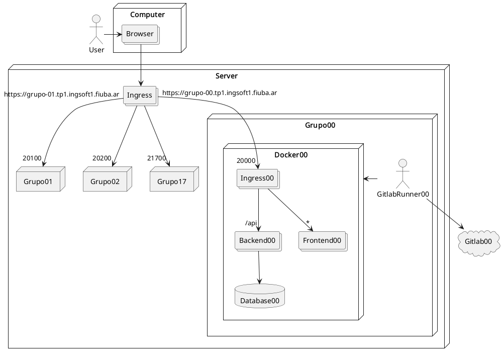

# 🍔 Sistema Comedor - Grupo 12

Un sistema web integral diseñado para la digitalización y gestión eficiente de todas las operaciones de un comedor universitario o institucional.

---

## 📖 Acerca del Proyecto

Este proyecto nació como un trabajo práctico en el ámbito académico. Su principal objetivo es demostrar la capacidad de diseñar, desarrollar y desplegar una arquitectura de software moderna abordando todos sus componentes (Frontend, Backend, y Redes) a través de un caso de uso real: la gestión y digitalización de un comedor.

A través de esta implementación, el equipo trabajó en lograr la comunicación entre distintos microservicios/contenedores conectados por medio de peticiones HTTP, y manejar el ciclo de vida completo del desarrollo de una aplicación web, desde los repositorios hasta su despliegue dentro del ciclo lectivo.

### 🎯 Objetivos Académicos y Técnicos
- **Desarrollo de API RESTful en Backend:** Diseño y desarrollo de endpoints con **Java Spring Boot**, manejo de bases de datos, lógica de negocios y seguridad.
- **Creación de un Frontend Escalable:** Desarrollo de una aplicación SPA (Single Page Application) robusta utilizando **React, TypeScript y Vite**, aplicando ruteo, autenticación y comunicación constante con las APIs.
- **Arquitectura y Contenedores (Docker):** Integrar y configurar un entorno Multi-Contenedor (Frontend, Backend y un Reverse Proxy manejado por **NGINX**) aislando y estandarizando todos sus procesos.
- **Buenas Prácticas y Entregas Ágiles:** Implementación de tests de componentes, uso de variables de entorno y documentación respaldando el progreso progresivo a través de múltiples **Sprints**.

---

## 🚀 Módulos Principales

El proyecto cuenta con varias secciones orientadas a distintos roles:
- **Administración:** Gestión de productos, ingredientes, combos, promociones y usuarios.
- **Cocina (Staff):** Recepción y actualización en tiempo real de los estados de los pedidos.
- **Usuarios / Estudiantes:** Catálogo de menú, carrito de compras, gestión de cuenta y seguimiento de sus pedidos con sistema de autenticación.

## 🛠️ Tecnologías Utilizadas

### [Backend](./backend/README.md)
Desarrollado en **Java / Spring Boot**, encargado de exponer y proteger la lógica de negocio y las integraciones con la base de datos.

### [Frontend](./frontend/README.md)
Aplicación basada en **React y TypeScript** (compilada con Vite). Proporciona una interfaz moderna, responsiva y amigable para interactuar con la lógica del negocio. Cuentan con pruebas automatizadas usando Vitest.

### [Ingress / Reverse Proxy](./ingress/README.md)
Implementado con **NGINX**, funciona como el punto de entrada al sistema, redirigiendo todas las peticiones a los respectivos microservicios contenedores según su ruta.

### Cómo ejecutar el sistema en local:

Para levantar todo el entorno de la aplicación de manera local usando `docker-compose`:

1. Asegúrate de tener preconfigurado el archivo de variables de entorno (copiar desde un archivo base a `.env` si es necesario).
2. Ejecuta el entorno con el siguiente comando:

```bash
docker compose up -d --build --remove-orphans
```

El Ingress redirigirá y agrupará el tráfico bajo un solo dominio a los diversos contenedores.

La arquitectura de los contenedores locales está estructurada de la siguiente forma:



---

## 📦 Entregables y Seguimiento de Sprints

Documentación y versiones entregadas del proyecto separadas por Sprints:

- **Sprint 1:** [Ver Entregables (Drive)](https://drive.google.com/drive/folders/1JAMdP34s8OLOotGd5m4oXwyUlAucoQpO?usp=sharing)
- **Sprint 2:** [Ver Entregables (Drive)](https://drive.google.com/drive/folders/1dtzMeCxkHgLxN3_OLnjQF8mw5vPutKhN?usp=drive_link)
- **Sprint 3:** [Ver Entregables (Drive)](https://drive.google.com/drive/folders/1DEfI4ww14RdhMfvByBbSFFvNKEcsvBzI?usp=sharing)
- **Sprint 4:** [Ver Entregables (Drive)](https://drive.google.com/drive/folders/1KCzumwZ2PRlQMttitAg8Vr1LYzRJZUaX?usp=sharing)
- **Entrega Final:** [Ver Sistema Completo (Drive)](https://drive.google.com/drive/folders/1W9O6uJU6BrYQebC8KHChqLTS-ksYDja0?usp=sharing)